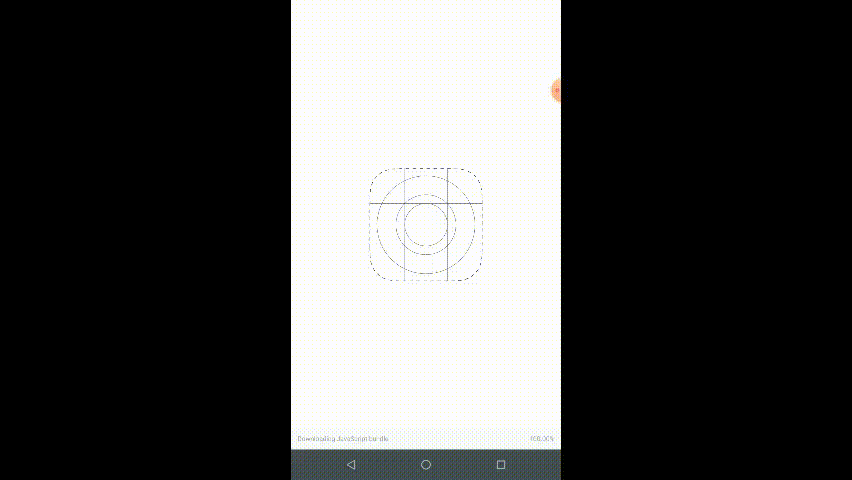

# Ecoleta

Ecoleta é um marketplace para coleta de resíduos recicláveis onde pessoas podem cadastrar seus pontos de coletas no Website, e pessoas podem procurar por pontos de coleta no aplicativo mobile.

## Stack

O Ecoleta é construído com um foco na stack de Node.Js incluindo as seguintes tecnologias:

- Typescript
- React
- React Native (Expo)
- Express
- Sqlite3

## App overview

<div style="display: flex; justify-content: space-around;">
  
  
</div>

# Installation

É necessário rodar o comandos à seguir em seus respectivos diretórios à seguir:

```bash
# Ecoleta/server
`npm install`
`npm run knex:migrate`
`npm run knex:seed`

# Ecoleta/web
`npm install`

# Ecoleta/mobile
`npm install`
```

Após o término da instalação é possível rodar os respectivos módulos utilizando os comandos à seguir:

- server: `npm run dev`
  - Obs: deve estar ligado à todo momento para rodar a aplicação corretamente
- web: `npm run start`
- mobile: `npm run start`
